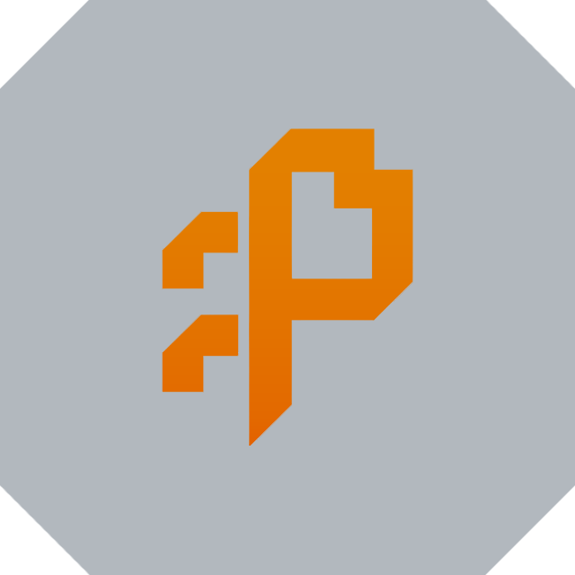

  
  
  <h1>opi</h1>

opi is my fork of OpenCode.

i made it because i wanted a version i could shape around my own workflow without waiting on upstream every time i wanted to change the TUI, experiment with agent behavior, or wire in opinionated local tooling.

it is not meant to be a totally separate product. it is the version of OpenCode I can move fast in, keep close to my exact setup, and use as a place to prove ideas before deciding what should stay fork-only and what might be worth pushing upstream later.

its also my cope of Pi. i love OpenCode (especially the TUI), but i wish it had the customizability and modularity that Pi offers for adding your own custom stuff onto it; so thats what im going to try and achieve here.
